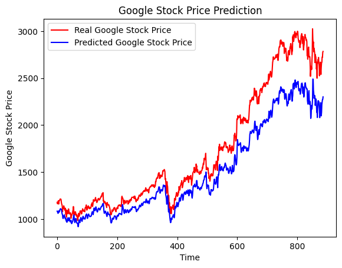

# Google-Stock-Price-Prediction
1. Developed a stock price trend prediction model using LSTM (Long Short Term Memory) based approach to resolve the vanishing gradient problem of RNN (Recurrent Neural Network).
2. Used GOOGL.csv file which is taken from Kaggle to train and test the model.
3. This dataset contain the stock market prices from 2004 to 2022.
4. Evaluated the model efficiency using RMSE (Root Mean Squared Error) method. Achieved an RMSE of 0.13 with respect to average target value for this model.
5. The trends are so accuarate as we evaluate from the graph.

# Google Stock Price Trends for the year 2022
 
